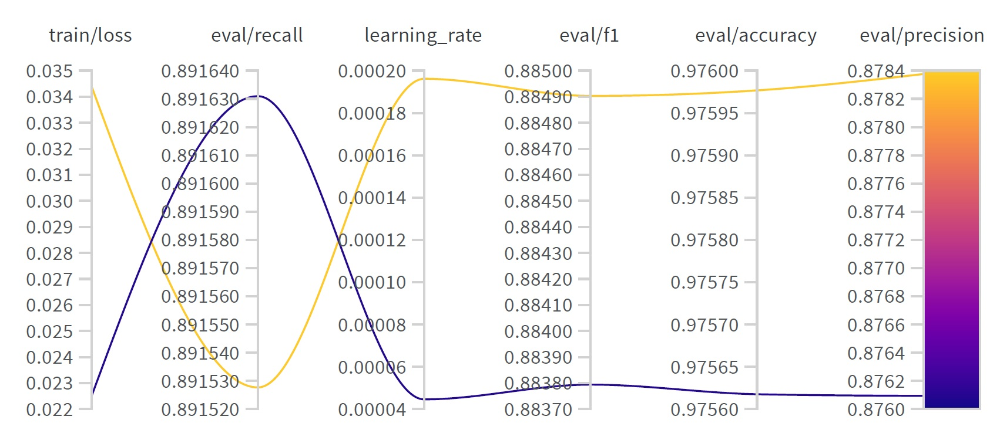

# ner_models
The project aims to fine tune the bert-base-uncase model for named entity recognition task on the MultiNERD dataset. I fine-tuned two models, A and B. The first model has been tuned on English samples of the MultiNERD dataset. Model A predicts 15 entity types and the O tag (i.e. not part of an entity). The model B is similar to the model A, however, has been tuned to predict only five entity types and also the non-entity tag .

## Running the files:
The name of files determines the order of the running process. 

### To have model A:

1_feature_engineering_english.ipynb
4_hyperparameter_tuning_model_A.ipynb

Inference pipeline:
5_inference_model_B.ipynb

### To have model B:

1_feature_engineering_english.ipynb
2_3_feature_engineering_tag_limitations.ipynb
4_hyperparameter_tuning_model_B.ipynb

Inference pipeline:
5_inference_model_B.ipynb

## Models on huggingface:

**Model A on huggingface:**
Link to the [Model A]: (https://huggingface.co/MaryDatascientist/modelA_1_12_2023)

**Model B on huggingface:**
Link to the [Model B]: (https://huggingface.co/MaryDatascientist/B_model2)

## Results on evaluation set:

**Model A achieves the following results on the evaluation set:**

| Accuracy  | Loss   |Precision  | Recall |   F1   |
| --------- | ------ | --------- | ------ |------- |
| 0.9756    | 0.0875 |  0.8761   | 0.8916 | 0.8838 |

**Model B achieves the following results on the evaluation set:**

| Accuracy  | Loss   |Precision  | Recall |   F1   |
| --------- | ------ | --------- | ------ |------- |
| 0.9883    | 0.0339 |  0.9316   | 0.9369 | 0.9342 |

## Report
The report charts are available in the Report folder. I used Weight&Biases for fine-tuning. For model A, count parameter in wandb.agent insturction is set to two. However, for model B, because of time and GPU limitation, I set the count to 1. Therefore, parallel coordination chart is only available for model A (as you can see here).

